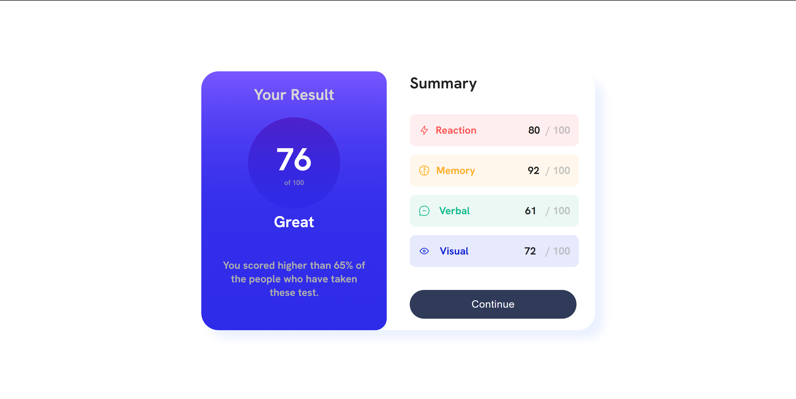
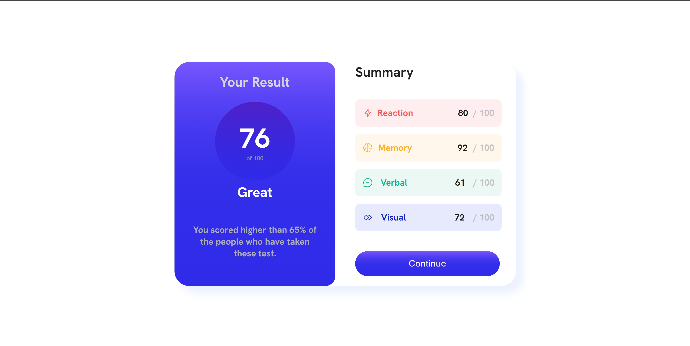

# Frontend Mentor - Results summary component solution

This is a solution to
the [Results summary component challenge on Frontend Mentor](https://www.frontendmentor.io/challenges/results-summary-component-CE_K6s0maV).
Frontend Mentor challenges help you improve your coding skills by building realistic projects.

## Table of contents

- [The challenge](#the-challenge)
- [Screenshots](#screenshots)
- [Links](#links)
- [Built with](#built-with)
- [Author](#author)

### The challenge

Users should be able to:

- View the optimal layout for the interface depending on their device's screen size
- See hover and focus states for all interactive elements on the page
- **Bonus**: Use the local JSON data to dynamically populate the content

### Screenshots

### Links

- Solution URL: [GitHub Solution](https://github.com/apodgornyitba/Results)
- Live Site URL: [Live Site URL](https://apodgornyitba.github.io/Results/)

### Built with

- [React](https://reactjs.org/) - JS library
- [Next.js](https://nextjs.org/) - React framework
- [Node.js](https://nextjs.org/) - Runtime Engine

## Author

- Website - [Andres Podgorny](https://github.com/apodgornyitba)
- Frontend Mentor - [@apodgornyitba](https://www.frontendmentor.io/profile/apodgornyitba)
- Twitter - [@PodgornyAndres](https://twitter.com/PodgornyAndres)